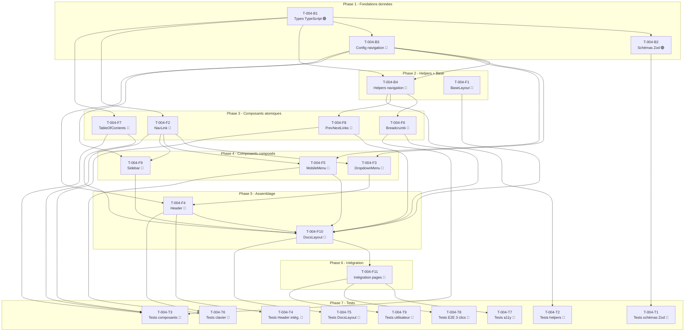

# US-004 : Naviguer facilement dans le framework

| Métadonnée | Valeur |
|------------|--------|
| **Complexité** | L (Large) |
| **Statut** | 🟡 En cours |
| **Date création** | 9 février 2026 |
| **Epic** | EPIC 2 : Consulter le Framework |

---

## 1. Description

**En tant que** Product Engineer
**Je veux** accéder rapidement à n'importe quelle section du framework ou du mode opératoire
**Afin de** trouver l'information dont j'ai besoin sans perdre de temps

---

## 2. Critères d'acceptation

- [ ] Menu de navigation principal avec :
  - Les 8 chapitres du Framework AIAD (Préambule à Annexes)
  - Les 8 chapitres du Mode Opératoire (Préambule à Annexes)
  - Les 9 catégories d'Annexes (A-I : Templates, Rôles, Boucles, Rituels, Métriques, Agents, Configuration, Bonnes Pratiques, Ressources)
  - Séparation visuelle claire entre Framework, Mode Opératoire et Annexes
- [ ] Sous-menu déroulant pour chaque partie (ex: Framework > Partie 1 > Rôles > Product Engineer)
- [ ] Breadcrumb sur toutes les pages (ex: Accueil > Framework > Partie 1 > Rôles > Product Engineer)
- [ ] Navigation clavier fonctionnelle (Tab, Shift+Tab, Enter)
- [ ] Liens "Précédent/Suivant" en bas de chaque page
- [ ] Table des matières sticky sur les pages longues
- [ ] Temps pour atteindre une page spécifique < 3 clics (validé par tests utilisateurs)

---

## 3. Inventaire du contenu à naviguer

### 3.1 Framework AIAD (8 chapitres)

| # | Fichier source | Titre |
|---|----------------|-------|
| 1 | `framework/01-preambule.md` | Préambule |
| 2 | `framework/02-vision-philosophie.md` | Vision & Philosophie |
| 3 | `framework/03-ecosysteme.md` | Écosystème |
| 4 | `framework/04-artefacts.md` | Artefacts |
| 5 | `framework/05-boucles-iteratives.md` | Boucles Itératives |
| 6 | `framework/06-synchronisations.md` | Synchronisations |
| 7 | `framework/07-metriques.md` | Métriques |
| 8 | `framework/08-annexes.md` | Annexes |

### 3.2 Mode Opératoire (8 chapitres)

| # | Fichier source | Titre |
|---|----------------|-------|
| 0 | `mode opératoire/00-preambule.md` | Préambule |
| 1 | `mode opératoire/01-initialisation.md` | Initialisation |
| 2 | `mode opératoire/02-planification.md` | Planification |
| 3 | `mode opératoire/03-developpement.md` | Développement |
| 4 | `mode opératoire/04-validation.md` | Validation |
| 5 | `mode opératoire/05-deploiement.md` | Déploiement |
| 6 | `mode opératoire/06-rituels-amelioration.md` | Rituels & Amélioration |
| 7 | `mode opératoire/07-annexes.md` | Annexes |

### 3.3 Annexes (9 catégories, 46 fichiers)

| Cat. | Nom | Fichiers | Nb |
|------|-----|----------|----|
| A | Templates | A1-prd, A2-architecture, A3-agent-guide, A4-specs, A5-dood, A6-dooud | 6 |
| B | Rôles | B1-product-manager, B2-product-engineer, B3-qa-engineer, B4-tech-lead, B5-supporters, B6-agents-engineer | 6 |
| C | Boucles | C1-phase-initialisation, C2-boucle-planifier, C3-boucle-implementer, C4-boucle-valider, C5-boucle-integrer | 5 |
| D | Rituels | D1-alignment-strategique, D2-demo-feedback, D3-tech-review, D4-retrospective, D5-standup | 5 |
| E | Métriques | E1-exemples-dashboards, E2-revue-trimestrielle | 2 |
| F | Agents | F1-agent-security, F2-agent-quality, F3-agent-architecture, F4-agent-documentation, F5-agent-performance, F6-agent-code-review, F7-autres-agents | 7 |
| G | Configuration | G1-configuration-environnement, G2-installation-agents-ia, G3-setup-ci-cd, G4-configuration-permissions, G5-installation-mcp-plugins, G6-creation-subagents | 6 |
| H | Bonnes Pratiques | H1-prompts-efficaces, H2-patterns-code, H3-anti-patterns, H4-cas-usage-specs, H5-notes-apprentissage | 5 |
| I | Ressources | I1-troubleshooting, I2-glossaire, I3-bibliographie, I4-communaute | 4 |

---

## 4. Décomposition en tâches

### 4.1 Backend / Données

| ID | Tâche | Durée | Dépendances | Statut |
|----|-------|-------|-------------|--------|
| T-004-B1 | Définir les types TypeScript de navigation (NavigationItem, BreadcrumbItem, TOCItem, PrevNextItem) | 2h | - | 🟢 Terminée |
| T-004-B2 | Créer les schémas Zod de validation pour les données de navigation | 1.5h | T-004-B1 | 🟢 Terminée |
| T-004-B3 | Créer la configuration de navigation (arbre hiérarchique Framework 8 chap. + Mode Opératoire 8 chap. + Annexes 9 cat.) | 3h | T-004-B1 | 🟢 Terminée |
| T-004-B4 | Créer les helpers de navigation (getNavigation, getBreadcrumbs, getPrevNext, getCurrentSection, flattenNav) | 3h | T-004-B1, T-004-B3 | 🟢 Terminée |

### 4.2 Frontend

| ID | Tâche | Durée | Dépendances | Statut |
|----|-------|-------|-------------|--------|
| T-004-F1 | Créer le composant BaseLayout (HTML shell, head, meta, skip-link, slots) | 2h | - | 🟢 Terminée |
| T-004-F2 | Créer le composant NavLink (lien de navigation avec état actif et indicateur visuel) | 1.5h | T-004-B1 | 🔵 À faire |
| T-004-F3 | Créer le composant DropdownMenu (sous-menu déroulant multi-niveaux avec séparation visuelle Framework/ModeOp/Annexes) | 3h | T-004-F2, T-004-B3 | 🔵 À faire |
| T-004-F4 | Créer le composant Header (barre de navigation principale desktop avec 3 sections + dropdowns) | 3h | T-004-F3, T-004-B3 | 🔵 À faire |
| T-004-F5 | Créer le composant MobileMenu (hamburger + overlay plein écran + navigation accordéon) | 3h | T-004-F2, T-004-B3 | 🔵 À faire |
| T-004-F6 | Créer le composant Breadcrumb (fil d'Ariane dynamique basé sur l'URL) | 2h | T-004-B4 | 🔵 À faire |
| T-004-F7 | Créer le composant TableOfContents sticky (extraction automatique des headings h2-h4) | 2.5h | T-004-B1 | 🔵 À faire |
| T-004-F8 | Créer le composant PrevNextLinks (liens Précédent/Suivant contextuels) | 2h | T-004-B4 | 🔵 À faire |
| T-004-F9 | Créer le composant Sidebar (navigation latérale docs avec sections dépliables) | 3h | T-004-F2, T-004-B3 | 🔵 À faire |
| T-004-F10 | Créer le layout DocsLayout (assemblage Header + Sidebar + Content + TOC + Breadcrumb + PrevNext) | 3h | T-004-F1, T-004-F4, T-004-F5, T-004-F6, T-004-F7, T-004-F8, T-004-F9 | 🔵 À faire |
| T-004-F11 | Intégrer la navigation dans les pages existantes et créer les routes dynamiques | 2h | T-004-F10 | 🔵 À faire |

### 4.3 Tests

| ID | Tâche | Durée | Dépendances | Statut |
|----|-------|-------|-------------|--------|
| T-004-T1 | Tests unitaires schémas Zod de navigation (types, validation, cas limites) | 2h | T-004-B2 | 🔵 À faire |
| T-004-T2 | Tests unitaires helpers de navigation (getBreadcrumbs, getPrevNext, flattenNav, getCurrentSection) | 2.5h | T-004-B4 | 🔵 À faire |
| T-004-T3 | Tests unitaires composants atomiques (NavLink, Breadcrumb, PrevNextLinks, TableOfContents) | 3h | T-004-F2, T-004-F6, T-004-F7, T-004-F8 | 🔵 À faire |
| T-004-T4 | Tests d'intégration Header + DropdownMenu (ouverture/fermeture, navigation, responsive) | 2.5h | T-004-F4 | 🔵 À faire |
| T-004-T5 | Tests d'intégration DocsLayout complet (assemblage, responsive, slots) | 3h | T-004-F10 | 🔵 À faire |
| T-004-T6 | Tests navigation clavier (Tab, Shift+Tab, Enter, Escape, focus trap mobile) | 2.5h | T-004-F4, T-004-F5 | 🔵 À faire |
| T-004-T7 | Tests accessibilité RGAA AA (axe-core sur toutes les pages avec navigation) | 2.5h | T-004-F11 | 🔵 À faire |
| T-004-T8 | Tests E2E : validation règle des < 3 clics pour atteindre toute page | 3h | T-004-F11 | 🔵 À faire |
| T-004-T9 | Protocole de test utilisateur navigation (scénarios, grille d'évaluation, 5 utilisateurs) | 2h | T-004-F11 | 🔵 À faire |

---

## 5. Ordre d'implémentation optimal

```
Phase 1 - Fondations données (parallélisable)
├── T-004-B1 (Types TypeScript navigation)
├── T-004-B2 (Schémas Zod)              ←── dépend de B1
└── T-004-B3 (Configuration navigation)  ←── dépend de B1

Phase 2 - Helpers + Layout de base (parallélisable après Phase 1)
├── T-004-B4 (Helpers navigation)        ←── dépend de B1, B3
└── T-004-F1 (BaseLayout)               ←── indépendant

Phase 3 - Composants atomiques (parallélisable)
├── T-004-F2 (NavLink)                  ←── dépend de B1
├── T-004-F7 (TableOfContents sticky)   ←── dépend de B1
├── T-004-F6 (Breadcrumb)              ←── dépend de B4
└── T-004-F8 (PrevNextLinks)           ←── dépend de B4

Phase 4 - Composants composés (parallélisable)
├── T-004-F3 (DropdownMenu)            ←── dépend de F2, B3
├── T-004-F5 (MobileMenu)             ←── dépend de F2, B3
└── T-004-F9 (Sidebar)                ←── dépend de F2, B3

Phase 5 - Assemblage navigation
├── T-004-F4 (Header)                  ←── dépend de F3, B3
└── T-004-F10 (DocsLayout)            ←── dépend de F1, F4, F5, F6, F7, F8, F9

Phase 6 - Intégration
└── T-004-F11 (Intégration pages)      ←── dépend de F10

Phase 7 - Tests (parallélisable, démarrage anticipé possible)
├── T-004-T1 (tests schémas)           ←── dès Phase 1 (après B2)
├── T-004-T2 (tests helpers)           ←── dès Phase 2 (après B4)
├── T-004-T3 (tests composants atom.)  ←── après Phase 3
├── T-004-T4 (tests Header intég.)     ←── après Phase 5
├── T-004-T5 (tests DocsLayout intég.) ←── après Phase 5
├── T-004-T6 (tests clavier)           ←── après Phase 5
├── T-004-T7 (tests a11y)             ←── après Phase 6
├── T-004-T8 (tests E2E < 3 clics)    ←── après Phase 6
└── T-004-T9 (protocole utilisateur)   ←── après Phase 6
```

---

## 6. Diagramme de dépendances



---

## 7. Estimation globale

| Catégorie | Nb tâches | Durée estimée |
|-----------|-----------|---------------|
| Backend/Données | 4 | 9.5h |
| Frontend | 11 | 27h |
| Tests | 9 | 23h |
| **Total** | **24** | **59.5h** |

**Chemin critique :** B1 → B3 → B4 → F6 → F10 → F11 → T8

**Durée du chemin critique :** 2h + 3h + 3h + 2h + 3h + 2h + 3h = **18h**

**Parallélisation maximale :** Avec 2 développeurs, le projet peut être réalisé en ~30h calendaires grâce aux phases parallélisables (notamment Phase 3 et Phase 4).

---

## 8. Détail des composants cibles

### 8.1 Architecture des fichiers à créer

```
src/
├── components/
│   └── layout/
│       ├── Header.astro           ← T-004-F4
│       ├── NavLink.astro          ← T-004-F2
│       ├── DropdownMenu.astro     ← T-004-F3
│       ├── MobileMenu.astro       ← T-004-F5
│       ├── Breadcrumb.astro       ← T-004-F6
│       ├── TableOfContents.astro  ← T-004-F7
│       ├── PrevNextLinks.astro    ← T-004-F8
│       └── Sidebar.astro          ← T-004-F9
├── layouts/
│   ├── BaseLayout.astro           ← T-004-F1
│   └── DocsLayout.astro           ← T-004-F10
├── lib/
│   └── navigation.ts              ← T-004-B4
├── data/
│   └── navigation.ts              ← T-004-B3
└── types/
    └── navigation.ts              ← T-004-B1
```

### 8.2 Interfaces TypeScript prévues (T-004-B1)

```typescript
// src/types/navigation.ts

export interface NavigationItem {
  id: string
  label: string
  href: string
  section?: 'framework' | 'mode-operatoire' | 'annexes'
  children?: NavigationItem[]
  badge?: 'new' | 'essential'
  order: number
}

export interface BreadcrumbItem {
  label: string
  href: string
  isCurrent?: boolean
}

export interface TableOfContentsItem {
  depth: number    // 2-4 (h2-h4)
  text: string
  slug: string
}

export interface PrevNextItem {
  label: string
  href: string
  section?: string
}

export interface PrevNextLinks {
  prev: PrevNextItem | null
  next: PrevNextItem | null
}
```

### 8.3 Structure de navigation prévue (T-004-B3)

```
Navigation principale (Header)
├── Framework AIAD
│   ├── Préambule
│   ├── Vision & Philosophie
│   ├── Écosystème
│   ├── Artefacts
│   ├── Boucles Itératives
│   ├── Synchronisations
│   ├── Métriques
│   └── Annexes
├── Mode Opératoire
│   ├── Préambule
│   ├── Initialisation
│   ├── Planification
│   ├── Développement
│   ├── Validation
│   ├── Déploiement
│   ├── Rituels & Amélioration
│   └── Annexes
└── Annexes
    ├── A - Templates (6 fiches)
    ├── B - Rôles (6 fiches)
    ├── C - Boucles (5 fiches)
    ├── D - Rituels (5 fiches)
    ├── E - Métriques (2 fiches)
    ├── F - Agents (7 fiches)
    ├── G - Configuration (6 fiches)
    ├── H - Bonnes Pratiques (5 fiches)
    └── I - Ressources (4 fiches)
```

### 8.4 Maquette layout DocsLayout (T-004-F10)

```
┌──────────────────────────────────────────────────────────────────┐
│  [Skip to content]                                               │
├──────────────────────────────────────────────────────────────────┤
│  LOGO    Framework ▾    Mode Opératoire ▾    Annexes ▾    [≡]   │
│          ┌─────────┐                                             │
│          │ Dropdown │  (visible au hover/clic)                   │
│          └─────────┘                                             │
├──────────────────────────────────────────────────────────────────┤
│  Accueil > Framework > Partie 1 > Product Engineer  (Breadcrumb)│
├────────────┬─────────────────────────────────┬───────────────────┤
│  SIDEBAR   │         CONTENU PRINCIPAL       │  TABLE DES        │
│            │                                 │  MATIÈRES (sticky) │
│  Framework │  # Titre H1                     │                   │
│  ├ Préamb. │                                 │  • Section 1      │
│  ├ Vision  │  ## Section 1                   │  • Section 2      │
│  ├ Écosy.  │  Lorem ipsum dolor sit amet...  │    ├ Sous-sect.   │
│  ├ Artef.  │                                 │  • Section 3      │
│  ├ Boucles │  ## Section 2                   │                   │
│  ├ Synchro │  Lorem ipsum dolor sit amet...  │                   │
│  ├ Métriq. │                                 │                   │
│  └ Annexes │  ### Sous-section               │                   │
│            │  Lorem ipsum dolor sit amet...  │                   │
│  Mode Op.  │                                 │                   │
│  ├ Préamb. │                                 │                   │
│  ├ Init.   │                                 │                   │
│  └ ...     │                                 │                   │
│            │                                 │                   │
│  Annexes   │                                 │                   │
│  ├ A-Templ │                                 │                   │
│  ├ B-Rôles │                                 │                   │
│  └ ...     │                                 │                   │
├────────────┴─────────────────────────────────┴───────────────────┤
│        ← Précédent : Vision & Philosophie                        │
│                            Suivant : Artefacts →                 │
├──────────────────────────────────────────────────────────────────┤
│  FOOTER                                                          │
└──────────────────────────────────────────────────────────────────┘
```

**Responsive (mobile < 768px) :**

```
┌──────────────────────────┐
│  LOGO           [≡]     │ ← Hamburger
├──────────────────────────┤
│  Accueil > Framework >.. │ ← Breadcrumb tronqué
├──────────────────────────┤
│                          │
│  # Titre H1              │
│                          │
│  [Table des matières]    │ ← Collapsible
│                          │
│  ## Section 1            │
│  Lorem ipsum...          │
│                          │
│  ## Section 2            │
│  Lorem ipsum...          │
│                          │
├──────────────────────────┤
│  ← Préc.    Suiv. →     │
├──────────────────────────┤
│  FOOTER                  │
└──────────────────────────┘
```

---

## 9. Contraintes techniques

| Contrainte | Détail |
|------------|--------|
| **Zero JS by default** | Navigation statique HTML/CSS, JS uniquement pour : dropdown au clavier, mobile menu toggle, TOC scroll spy |
| **Progressive enhancement** | Menu navigable sans JavaScript (liens directs fonctionnels) |
| **Accessibilité** | RGAA AA / WCAG 2.1 AA : rôles ARIA, focus visible, navigation clavier complète |
| **Responsive** | Mobile-first : 320px → 768px → 1024px → 1280px → 1920px+ |
| **Performance** | Navigation dans le HTML statique (pas de fetch côté client), CSS < 10kb pour les composants nav |
| **SEO** | Breadcrumb en JSON-LD (schema.org/BreadcrumbList), liens sémantiques `<nav>`, `<aside>` |
| **Astro Islands** | MobileMenu et TOC scroll spy en `client:idle` ou `client:media="(max-width: 768px)"` |

---

## 10. Fichiers de spécification détaillée

| Tâche | Fichier de spec |
|-------|-----------------|
| T-004-B1 | [T-004-B1-types-typescript-navigation.md](./T-004-B1-types-typescript-navigation.md) |
| T-004-B2 | [T-004-B2-schemas-zod-navigation.md](./T-004-B2-schemas-zod-navigation.md) |
| T-004-B3 | [T-004-B3-configuration-navigation.md](./T-004-B3-configuration-navigation.md) |
| T-004-B4 | [T-004-B4-helpers-navigation.md](./T-004-B4-helpers-navigation.md) |
| T-004-F1 | [T-004-F1-composant-BaseLayout.md](./T-004-F1-composant-BaseLayout.md) |
| T-004-F2 | [T-004-F2-composant-NavLink.md](./T-004-F2-composant-NavLink.md) |
| T-004-F3 | [T-004-F3-composant-DropdownMenu.md](./T-004-F3-composant-DropdownMenu.md) |
| T-004-F4 | [T-004-F4-composant-Header.md](./T-004-F4-composant-Header.md) |
| T-004-F5 | [T-004-F5-composant-MobileMenu.md](./T-004-F5-composant-MobileMenu.md) |
| T-004-F6 | [T-004-F6-composant-Breadcrumb.md](./T-004-F6-composant-Breadcrumb.md) |
| T-004-F7 | [T-004-F7-composant-TableOfContents.md](./T-004-F7-composant-TableOfContents.md) |
| T-004-F8 | [T-004-F8-composant-PrevNextLinks.md](./T-004-F8-composant-PrevNextLinks.md) |
| T-004-F9 | [T-004-F9-composant-Sidebar.md](./T-004-F9-composant-Sidebar.md) |
| T-004-F10 | [T-004-F10-layout-DocsLayout.md](./T-004-F10-layout-DocsLayout.md) |
| T-004-F11 | [T-004-F11-integration-pages-navigation.md](./T-004-F11-integration-pages-navigation.md) |
| T-004-T1 | [T-004-T1-tests-schemas-zod-navigation.md](./T-004-T1-tests-schemas-zod-navigation.md) |
| T-004-T2 | [T-004-T2-tests-helpers-navigation.md](./T-004-T2-tests-helpers-navigation.md) |
| T-004-T3 | [T-004-T3-tests-composants-atomiques.md](./T-004-T3-tests-composants-atomiques.md) |
| T-004-T4 | [T-004-T4-tests-integration-header.md](./T-004-T4-tests-integration-header.md) |
| T-004-T5 | [T-004-T5-tests-integration-docslayout.md](./T-004-T5-tests-integration-docslayout.md) |
| T-004-T6 | [T-004-T6-tests-navigation-clavier.md](./T-004-T6-tests-navigation-clavier.md) |
| T-004-T7 | [T-004-T7-tests-accessibilite-rgaa.md](./T-004-T7-tests-accessibilite-rgaa.md) |
| T-004-T8 | [T-004-T8-tests-e2e-regle-3-clics.md](./T-004-T8-tests-e2e-regle-3-clics.md) |
| T-004-T9 | [T-004-T9-protocole-test-utilisateur.md](./T-004-T9-protocole-test-utilisateur.md) |

---

## Changelog

| Version | Date | Modifications |
|---------|------|---------------|
| 1.0 | 09/02/2026 | Création initiale avec décomposition en 24 tâches |
